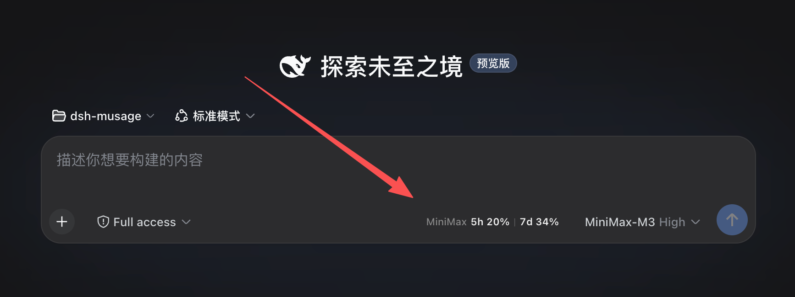
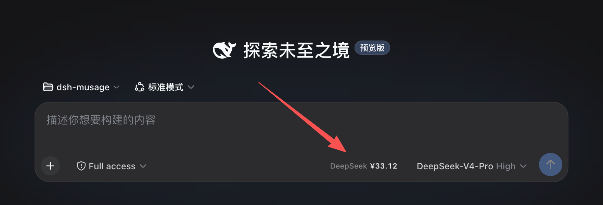
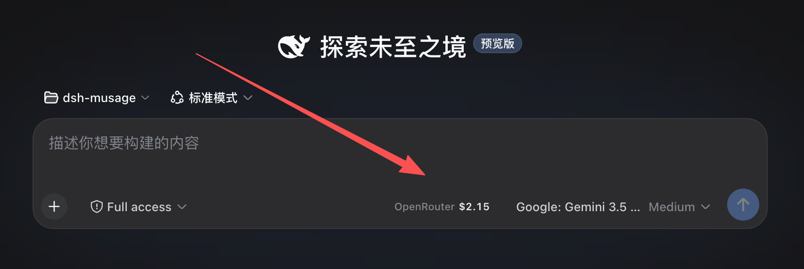
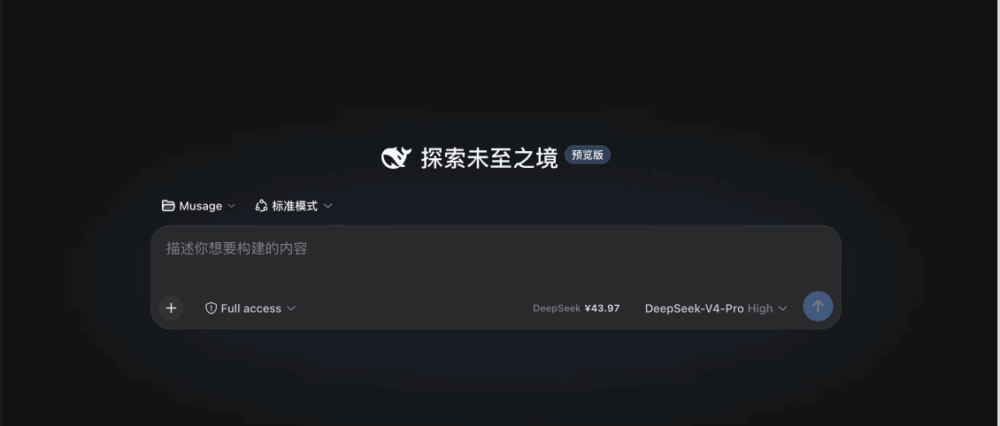

# dsh-musage

> DSH (DeepSeek Harness) 版的 [Musage](https://github.com/Thedeergod666/Musage) — 在 DSH composer 工具栏里实时显示 6 家 AI 套餐 provider 的用量余额, 跟着当前模型自动切换.

[](https://github.com/topics/dsh-plugin)
[](https://github.com/topics/cordis-plugin)
[](https://github.com/topics/dsh)
[](https://github.com/topics/ai-usage)
[](https://github.com/topics/coding-plan)
[](./LICENSE)
[](./CHANGELOG.md)
[](./docs/architecture.md)

## Screenshots







## 这是什么

[Musage](https://github.com/Thedeergod666/Musage) 是我 (Thedeergod666) 维护的 Tauri 桌面应用, 核心功能是实时跨 **14 个** AI 套餐 provider 监控用量 (悬浮窗 + 系统托盘). 桌面形态完整有效, 但跟 DSH 这类 AI harness 生态割裂, 用户切到 DSH 工作时看不到用量.

**dsh-musage** 把 Musage 的核心能力**搬进 DSH 浏览器页面里**:

- ✅ **6 个 provider** 当前实装: MiniMax · DeepSeek · Kimi · OpenRouter · 智谱 GLM (zai-coding-cn) · 阿里云百炼 Coding Plan (dashscope)
- ✅ **跟着模型自动切换** — 切到 minimax-cn 显示套餐用量, 切到 deepseek 显示余额, 切到 zai-coding-cn 显示智谱套餐, … 全自动
- ✅ **复用 DSH 已配 API Key** — 在 DSH 模型设置里配过 minimax / deepseek / openrouter / zhipu / dashscope 的话, plugin 立刻拿到, 不需重复填
- ✅ **5h + 周 双窗口套餐** (minimax / kimi / zhipu), **5h/周/月 三窗口** (百炼 Coding Plan) 或 **余额** (deepseek / openrouter) 自动选合适显示
- ✅ **零侵入** — 注册到 `conversation.input.right` slot (紧邻 model select; DSH 0.1.x RC 架构下在其**右侧**、send 按钮之前, 更老架构在左侧), 不挡对话/输入
- ✅ **失败静默** — 拉数据失败只显示 `Provider ⚠`, hover 看具体错误, 不刷屏

## 演示



> (GIF: minimax 5h/周 双窗口 → 切到 deepseek 自动显示余额 → 切到 zai-coding-cn 显示智谱套餐. 中间切换无刷新无 loading 态.)

## 支持的 Provider

| Provider (DSH route id) | 显示 | 端点 | Schema 来源 |
|---|---|---|---|
| `minimax` / `minimax-cn` / `minimax-en` | `MiniMax 5h X% \| 7d Y%` | `api.minimaxi.com/coding_plan/remains` | Musage minimax.rs (ccswitch 逆向, 2026-06-01 双 schema) |
| `deepseek` / `deepseek-official` | `DeepSeek ¥X.XX` (CNY) / `$X.XX` (USD) | `api.deepseek.com/user/balance` | Musage deepseek.rs |
| `kimi` / `kimi-coding` | `Kimi 5h X% \| 7d Y%` | `api.kimi.com/coding/v1/usages` | Musage kimi.rs |
| `openrouter` | `OpenRouter $X.XX` | `openrouter.ai/api/v1/credits` | Musage openrouter.rs |
| `zhipu` / `zai-coding-cn` | `Zhipu 5h X% \| 7d Y%` | `open.bigmodel.cn/api/monitor/usage/quota/limit` | Musage zhipu.rs |
| `dashscope` / `bailian` / `qwen` / `coding-plan` / ... | `Bailian 5h X% \| Wk Y% \| Mo Z%` (三窗口) | `bailian.console.aliyun.com` (国内) → `modelstudio.console.alibabacloud.com` (国际回退) · `queryCodingPlanInstanceInfoV2` | 控制台 API (第三方实现验证) |

**显示**根据 `state.currency` 字段自动选 `¥` / `$` 符号, 同一份 plugin 国内/海外账号都直接显示对.

### 百炼 Coding Plan 的 key 说明

阿里云百炼 Coding Plan 用的是**专用 API Key (`sk-sp-` 开头) 和专用 Base URL (`coding.dashscope.aliyuncs.com`)**, 与按量计费的 `sk-` key / `dashscope.aliyuncs.com` **不互通**. 在 DSH 模型设置里添加 provider 时 (route id 任意, `dashscope` / `bailian` / `qwen` / `coding-plan` 都能识别), 请填 Coding Plan 专用 key —— 用量查询走百炼控制台 API, 国内宿主不可用时自动回退国际宿主. 套餐额度按模型调用次数计 (Pro: 5h 6000 / 周 45000 / 月 90000).

## 跟 [Musage](https://github.com/Thedeergod666/Musage) 桌面端的关系

| 维度 | [Musage](https://github.com/Thedeergod666/Musage) (桌面) | dsh-musage (本插件) |
|---|---|---|
| **形态** | 悬浮窗 + 系统托盘 + 系统启动 | DSH 页面内一行 |
| **覆盖 provider** | 14 个内置 (minimax / deepseek / xiaomi / tavily / zenmux / openrouter / kimi / zhipu / stepfun / siliconflow / claude_official / anysearch / volcengine_ark / tokendance) + 自定义 New API 中转站 | 6 个 (PoC 已覆盖 A 档最常见的 6 家) |
| **鉴权** | API Key + Cookie + WebView 一键登录 | 复用 DSH 模型设置已配 API Key (Bearer, 大多数) |
| **鉴权凭证来源** | 本地 `keys.json` (Unix 0600, 原子写) | DSH `credentials` Service (`.credentials.yaml`) |
| **跨屏置顶 / 系统托盘** | ✅ 私有 API | ❌ DSH 自身无此 slot |
| **WebView 一键登录** | ✅ (xiaomi / anysearch / stepfun / kimi 总套餐) | ❌ DSH 无 WebView 创建接口 |
| **发布渠道** | GitHub Releases (dmg / nsis / AppImage / deb / rpm) | `dsh plugin add` / npm / dsh-market (bundle 形态) |

**核心结论**: dsh-musage 是 Musage 在 DSH 内的**伴侣形态**, 不是替代品. 完整功能 (14 provider + 悬浮窗 + 托盘 + 一键登录) 仍然在 [Musage 桌面端](https://github.com/Thedeergod666/Musage). 本插件先做"DSH 内能用"路径, 6 个最常见 provider 已覆盖.

**为什么有这个项目**: 我用 DSH 写代码, 想一边写一边看套餐还剩多少, 不可能再开一个 Musage 桌面 app 切来切去. 直接嵌在 DSH composer 旁边最自然. 这也是**给 Musage 桌面端带量** — 体验到 DSH 端轻量用法的用户, 可能愿意装完整桌面 app 拿 14 provider + 系统托盘 + 跨屏置顶.

## 安装 / 部署

v0.1.0 起为可安装 bundle, 与 dsh-market 装的插件同一机制. **Web 和桌面端都能装, 但入口不同.**

### DSH 桌面端 (DeepSeek Harness.app)

桌面端是 DSH 官方产品, 内置了图形插件管理页:

1. 侧边栏点 **插件** (在「新会话」下面、「工作区」上面那个风车图标)
2. 点 **+ 添加插件**, 粘贴下面这行, 回车
3. **安装** → **立即启用**

```
github:Thedeergod666/dsh-musage
```

装完**不用重启** — 桌面端 profile 默认开着 HMR, patch 改动会自动重载. 刷一下页面, 回到会话看 composer 工具栏.

> ⚠️ 不要去 设置 → **内置插件**. 那个分区是只读清单, 列的是"本部署随附"的官方插件, 装不了也搜不到社区插件 — 装插件只有侧边栏那个页面.
>
> ⚠️ 桌面端 profile 被应用独占, `dsh plugin --profile desktop add ...` 会被 CLI 拒绝
> (`error: profile "desktop" is managed exclusively by the Electron application`).
> 桌面端只能通过上面那个界面装; `--profile web` 仍然是 CLI 可管的普通 profile.

### DSH Web (`dsh web`)

一条命令安装:

```sh
dsh plugin --profile web add github:Thedeergod666/dsh-musage
```

装完重启 `dsh web`. 收录 [awesome-dsh-plugin](https://github.com/awesome-dsh-plugin/awesome-dsh-plugin) 注册表后, 也可在 设置 → Plugin Market 一键安装/更新.

### 两种环境都要做的

1. 在 DSH 模型设置里配置好你要监控的 provider (minimax-cn / deepseek / zhipu / dashscope 等)
2. 切到对应 model, composer 工具栏里出现 `[Provider 5h X% | 7d Y%]` / `[Provider $X.XX]` / 百炼的三窗口 `[Bailian 5h X% | Wk Y% | Mo Z%]`

本地开发 / 升级 / 故障排查见 [`deploy.md`](./deploy.md).

> **桌面端额外注意**: 桌面端首次初始化只带 `minimax-cn` 一个 provider.
> 切到其它 provider 的模型前, 要先把 provider 声明写进 profile patch ——
> 见 [`deploy.md` 的「桌面端模型 provider 迁移`](./deploy.md#桌面端模型-provider-迁移).
> 光有 API Key 不会自动出现 provider 条目.

## 前置依赖

- DSH 部署里需要 `subprocess` + `credentials` + `timer` 三个 Service (DSH ship 自带, 不需额外安装)
- DSH 模型设置里配置好对应 provider 的 API Key (DSH 客户端 → 设置 → 模型 → 添加 provider, 填 API Key, 选 DSH 不一定 ship 的 provider 比如 `minimax-cn` / `kimi-coding` 时手动输 provider id)

## 架构

host 半边 [`dsh/index.js`](./dsh/index.js) (ESM: quota fetch + 缓存 + `GET /musage/quota` 路由), client 半边 [`dsh/client.js`](./dsh/client.js) (lazy-CJS: composer slot + 模型订阅). 参见 [`docs/architecture.md`](./docs/architecture.md) + [`docs/cordis-pitfalls.md`](./docs/cordis-pitfalls.md) (15 个踩坑沉淀).

## License

MIT, Copyright (c) 2026 Thedeergod666.
